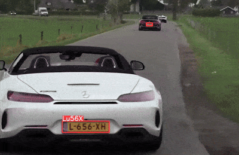

# Automatic Number Plate Recognition (ANPR)

This repository provides an implementation of Automatic Number Plate Recognition (ANPR) using the YOLO model for license plate detection and EasyOCR for character recognition. This project is designed to detect license plates in videos and extract the characters for further processing.

---

## Table of Contents

1. [Overview](#overview)
2. [Setup and Installation](#setup-and-installation)
3. [Dataset Preparation](#dataset-preparation)
4. [Usage](#usage)
    - [Model Training](#model-training)
    - [Inference](#inference)
    - [Detection and Recognition](#detection-and-recognition)
5. [Folder Structure](#folder-structure)
6. [Sample Output](#sample-output)
7. [Contributing](#contributing)

---

## Overview

Automatic Number Plate Recognition (ANPR) systems are widely used in industries such as vehicle identification, traffic monitoring, and parking management. This project integrates:

- **YOLO**: A state-of-the-art object detection model for identifying license plates.
- **EasyOCR**: A lightweight OCR library for character extraction from detected plates.

---

## Setup and Installation

### Prerequisites

- Python 3.8+
- pip3

### Clone the Repository

```bash
git clone https://github.com/routerarchitects/ANPR.git
cd ANPR
```

### Install Dependencies

```bash
python3 -m venv .venv
source .venv/bin/activate
pip3 install hydra-core==1.3.2 easyocr==1.7.2 ultralytics==8.0.0
```

---

## Dataset Preparation

Download and annotate data from [Roboflow](https://universe.roboflow.com/matheus-santos-almeida/car_license_plate):

```bash
mkdir dataset
cd dataset/
unzip ../car_license_plate.v1i.yolov11.zip
```

Ensure the dataset structure matches the folder organization described below.

---

## Usage

### Model Training

Train the YOLO model using the prepared dataset:

```bash
python3 train.py
```

The trained model weights will be saved in the `./runs/detect/train/weights/` directory.

---

### Inference

Use the trained YOLO model to detect license plates in a video:

```bash
python3 predict-license-plate.py
```

This script predicts license plates from vehicles in a video.

---

### Detection and Recognition

Combine YOLO detection with EasyOCR for full license plate recognition:

```bash
python3 predict_ocr_detection.py --model='./runs/detect/train/weights/best.pt' --source='./resources/car.mp4'
```

---

## Folder Structure

The project folder is organized as follows:

```
├── dataset                    # Download and unzip dataset here
│   ├── test
│   ├── train
│   └── valid
├── config.yaml                # Configuration file for dataset loading and training
├── predict_ocr_detection.py   # Script for inference and OCR
├── README.md
├── resources
│   └── car.mp4                # Sample video for testing
├── runs
│   ├── detect
│   │   ├── train
│   │   │   └── weights
│   │   │       ├── best.pt
│   │   │       └── last.pt
├── predict-license-plate.py   # Script for model prediction validation
├── train.py                   # Script for training the model
```

- **`resources/`**: Directory containing test videos.
- **`dataset/`**: Directory containing datasets for training and validation.
- **`best.pt`**: Trained model weights used for detection.
- **`config.yaml`**: Configuration file for dataset loading and training.

---

## Sample Output



---

## Contributing

Contributions are welcome! To contribute:

1. Fork the repository.
2. Create a feature branch:
   ```bash
   git checkout -b feature-name
   ```
3. Commit your changes:
   ```bash
   git commit -m 'Add feature'
   ```
4. Push to the branch:
   ```bash
   git push origin feature-name
   ```
5. Open a pull request.

---
